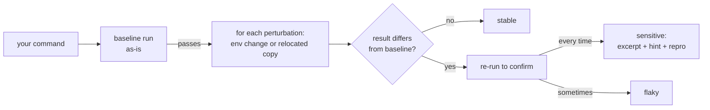

<div align="center">

# shakeout

**Run any command under realistic environment changes and see which hidden assumption breaks it.**<br>
Timezone, locale, empty `HOME`, a path with spaces, CI variables, `TMPDIR` and more. No config, no dependencies, no API keys.

[](https://github.com/Nithinfgs/shakeout/actions/workflows/ci.yml)
[](LICENSE)


```sh
npx github:Nithinfgs/shakeout -- npm test
```



</div>

## In 20 seconds

"Works on my machine" is almost always an assumption your code makes about the environment: *the
timezone is mine*, *`~/.cache` exists*, *the locale formats numbers like en-US*, *there is no space in
my path*. You discover it when CI, a container, a teammate, or a coding agent in a sandbox runs the
same command somewhere else.

`shakeout` finds those assumptions before they find you:

1. It runs your command once as-is (the baseline).
2. It runs it again, once per **perturbation**: a single, realistic change to the environment.
3. Anything that flips the result is re-run to confirm, then reported with an excerpt of what changed,
   what it usually means, and a command to reproduce it by hand.

Because each perturbation changes exactly one thing, the failure **names its own cause**. There is
no bisecting.

## Why this exists

Matrix builds can vary the timezone, but only if you already suspect the timezone, and every
ecosystem has its own recipe (`TZ=` for Jest, `-Duser.timezone` for Java, `tox`, ...). The things that
actually bite are the ones nobody thought to put in the matrix: an unquoted `$TMPDIR`, a missing
`~/.config`, a `LANG` that formats `1234.5` as `1.234,5`.

shakeout is that matrix, prebuilt, for any command in any language, with output that tells you what
to fix. It is also a cheap way to check whether a project is safe to run in a fresh sandbox, which
matters more as more code runs in containers and agent workspaces.

## Quick start

Requires Node 20 or newer. Nothing else.

```sh
# in your project, with your normal test / build / lint command
npx github:Nithinfgs/shakeout -- npm test
npx github:Nithinfgs/shakeout -- pytest -q
npx github:Nithinfgs/shakeout -- cargo test
npx github:Nithinfgs/shakeout "make check"          # quoted strings run through sh
```

Or install it once:

```sh
npm install -g github:Nithinfgs/shakeout
shakeout --list                 # every perturbation and what it changes
```

Exit codes: `0` nothing found, `1` at least one assumption found, `2` usage error or the command
already fails without any change (there is nothing to compare).

Try it on the bundled demo project, which hides five assumptions that all pass on a normal laptop (seven perturbations catch them):

```sh
git clone https://github.com/Nithinfgs/shakeout && cd shakeout
npm run demo
```

## Example

```text
$ shakeout -- node checks.js

shakeout · node checks.js · 20 perturbations · baseline ok (0.1s)

  ✔ tz-utc         same
  ✘ tz-los-angeles exit 1 3/3 reproduced
  ✘ tz-kiritimati  exit 1 3/3 reproduced
  ✘ locale-german  exit 1 3/3 reproduced
  ✘ home-empty     exit 1 3/3 reproduced
  ✔ path-spaces    same
  ✘ tmpdir-spaces  exit 1 3/3 reproduced
  ...

✘ tz-kiritimati [tz]  TZ=Pacific/Kiritimati (UTC+14, the furthest east)
    │ FAIL noon job on 2024-06-01 is scheduled for 2024-06-01
    │ expected "2024-06-01", got "2024-05-31"
    → Local time is more than 12h ahead of UTC, so "local noon" is still yesterday in UTC.
    $ env TZ=Pacific/Kiritimati node checks.js

✘ tmpdir-spaces [tmp]  TMPDIR contains a space
    │ FAIL pack.sh packs both sample files
    │ scripts/pack.sh: line 8: [: <PATH>/tmp: binary operator expected
    → Temp-file paths are interpolated into a shell command without quoting.
```

The demo's code is in [`examples/demo-app`](examples/demo-app): five ordinary-looking functions, each
with one hidden assumption.

## What it checks

| Category | Perturbations | Typical bug it exposes |
| --- | --- | --- |
| `tz` | UTC, Los Angeles, Pago Pago (UTC-11), Kolkata (+5:30), Kiritimati (+14) | UTC-parsed dates read back in local time; whole-hour offset assumptions |
| `locale` | `C`, unset, Turkish, German | `1.234,5` vs `1,234.5`; locale-dependent case mapping and sort order |
| `home` | `HOME` is a fresh empty directory | assumes `~/.config`, `~/.cache` or a dotfile exists |
| `path` | spaces, non-ASCII, 16 levels deep | unquoted `$PWD`; ASCII-only assumptions; path-length limits |
| `tmp` | `TMPDIR` contains a space | unquoted temp paths in shell commands |
| `term` | `TERM=dumb`, `NO_COLOR`, 40 columns | output parsing and snapshots that depend on colour or width |
| `ci` | `CI=true`, or every CI variable removed | behaviour that silently differs on CI |
| `process` | `umask 077`, one thread, `PYTHONHASHSEED` | permission, deadlock and ordering assumptions |
| `net` *(opt-in)* | proxy variables point at a closed port | the command quietly needs the network |

`shakeout --list` prints the exact settings. Everything is a plain environment change or a relocated copy of
your project; nothing needs root, containers or network access.

## Features

- **Self-explaining failures.** One change per run, so the culprit is the perturbation name. Each
  report shows the first new error lines, a hint on what it usually means, and a paste-ready
  `env ... <your command>`.
- **Flaky-aware.** Differences are re-run (`--confirm`, default 2 extra runs). Intermittent failures are labelled
  *flaky*, not blamed on the environment. `--baseline-runs 3` warns if the baseline itself is unstable.
- **Output mode.** `--compare output` also flags changed output, after masking colour codes, paths,
  timestamps and durations. Useful for builds and CLIs that must be reproducible. Add `--ignore <regex>`
  for your own noise.
- **Realistic path tests.** Path perturbations run from a copy of your project in a temp directory
  (without `.git`; `node_modules` is symlinked), so your working tree is never touched.
- **CI-ready.** `--json`, `--markdown` (pipe to `$GITHUB_STEP_SUMMARY`) and exit codes.
- **Extensible.** Add your own perturbations in `shakeout.json` or send a PR for the built-in list.
- **Zero runtime dependencies**, no network, no telemetry.

## How it works



The engine ([`src/engine.js`](src/engine.js)) spawns your command without a TTY, in its own process
group so a hang is killed cleanly on timeout. A result "differs" when the exit code or signal changes,
the command times out, or (output mode) the normalised output changes. The excerpt is the first run of
lines that are new compared to the baseline and look like errors. The catalogue lives in
[`src/perturbations.js`](src/perturbations.js) and is plain data.

## Use cases

- **Before you trust a green CI.** Run it locally; fix what it finds, or pin the variable explicitly.
- **Debugging "fails only on CI".** Find which difference (UTC? no `HOME`? `CI=true`?) is responsible.
- **Preparing a repo for a fresh container or coding-agent sandbox.** Does it survive an empty `HOME`
  and a different `TMPDIR`?
- **Reproducible builds and CLIs.** `--compare output` shows what your output secretly depends on.
- **In CI**, to keep new assumptions out:

  ```yaml
  - run: npx github:Nithinfgs/shakeout --markdown -- npm test >> "$GITHUB_STEP_SUMMARY"
  ```

## Configuration

Everything works with no config. To customise, add `shakeout.json` (validated, with a
[JSON schema](shakeout.schema.json)):

```json
{
  "compare": "exit",
  "timeout": 300,
  "skip": ["path-deep"],
  "perturbations": [
    {
      "id": "region-eu",
      "description": "REGION=eu-west-1 instead of the developer default",
      "env": { "REGION": "eu-west-1" },
      "hint": "Code hard-codes the default region."
    }
  ]
}
```

Useful flags:

| Flag | Meaning |
| --- | --- |
| `--only tz,home-empty` | run only these perturbations or categories |
| `--skip path-deep` | skip these |
| `--all` | include opt-in perturbations such as `net-blackhole` |
| `--compare output` | also flag changed output |
| `--ignore '<regex>'` | drop matching text before comparing (repeatable) |
| `--confirm <n>` / `--baseline-runs <n>` | flakiness checks |
| `--timeout <s>` | per-run timeout (default 120) |
| `--json` / `--markdown` | machine-readable reports |
| `--verbose` | show the full output of failing runs |

## Limitations

Being upfront about what this is not:

- It reports *sensitivity*, not *bugs*. Some failures are fine (a tool genuinely needs `HOME`); use
  `--skip` or a custom config for those.
- It changes the environment of your whole toolchain, so a package manager that needs `HOME` can fail
  before your code runs. Read the excerpt.
- It cannot fake the clock. Time-of-day and DST-transition bugs need a tool like `libfaketime` (see roadmap).
- POSIX only for now (macOS, Linux). Windows is not tested.
- `locale-*` perturbations set variables; if a locale is not installed on your machine, programs
  that rely on libc locales fall back silently, so a pass there is weaker evidence than a pass for `tz-*`.
- Path perturbations copy your project (excluding `.git` and `node_modules`); very large repos copy slowly.
  Skip them with `--skip path`.

## Roadmap

- [ ] Clock perturbations via `libfaketime` when installed (DST edges, leap days, year 2038)
- [ ] Windows support
- [ ] `--jobs` to run perturbations in parallel, each in its own copy
- [ ] Automatic minimisation: bisect a combined failing set down to the smallest culprit set
- [ ] Rootless network isolation where the OS allows it
- [ ] More perturbations: read-only project directory, low `ulimit -n`, case-insensitive filesystems

Ideas welcome as [perturbation requests](https://github.com/Nithinfgs/shakeout/issues/new?template=perturbation_request.md).

## Contributing

The best first contribution is a new perturbation: a realistic environment difference that breaks real
software, plus a hint. It is about ten lines of data. See [CONTRIBUTING.md](CONTRIBUTING.md).

```sh
npm install && npm run check
```

## License

[MIT](LICENSE)
